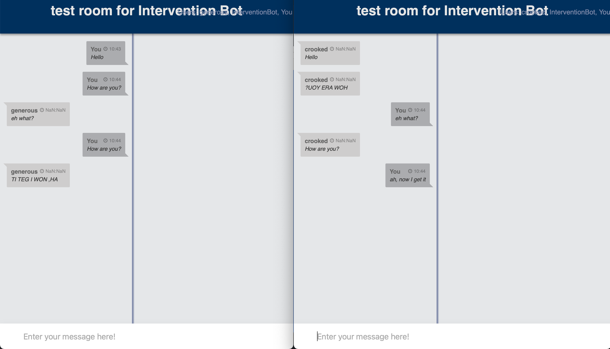

## Intervention Bot

This bot intercepts all messages sent by the users in a room while staying hidden. Messages are displayed as being sent by the users themselves. This allows modifying or hiding messages as required.

The bot works on a layout that treats all messages as commands, using the send-intercepted-message plugin. No special syntax is required for this, the idea is that users are not aware that their messages are altered. Users need to have the `send_command` permission.

## Setting up and running

### Setup 

1. Install [Docker](https://docs.docker.com/get-docker/). You might also need the [jq package](https://stedolan.github.io/jq/download/) too. 
2. Clone the [slurk](https://github.com/clp-research/slurk) repository.
3. Before running the bot, several environmental variables would need to be generated and assigned. This process is detailed in the [documentation](https://clp-research.github.io/slurk/slurk_gettingstarted.html), which details both the general preparation and the [bot specific initialisations](https://clp-research.github.io/slurk/slurk_gettingstarted.html#chatting-with-a-bot). The bot also needs to have specific permissions, listed below this paragraph. The above permissions can be found in [this example permissions file](https://github.com/clp-research/slurk-bots/blob/master/intervention/intervention_bot_permissions.json) already.  
    ```
    {
        "api": true,
        "send_message": true,
        "send_privately": true
    }
    ```
 4. Make sure that the [slurk](https://github.com/clp-research/slurk) and slurk-bots repositories live next to each other on the same level.
 5. Navigate to the base directory of the slurk-bots repository and run the script to launch this bot, your command should look like this:  
 ```$ python start_bot.py intervention/ --users 2 --tokens --dev```.  
 This script will build and run the docker images, it will initialise all the env variables with the right permissions and it will set everything up for testing locally on your computer. The bot will appear in your containers list as ```slurk/intervention```.
    
### Running and playing the bot
If you have everything already set up, you can run the bot using the following command (take notice of the right env variable names):    
```bash
docker run \
  --net="host" \
  -e BOT_TOKEN=$INT_TOKEN \
  -e BOT_USER=$INT_USER \
  -e SLURK_PORT=5000 \
  -e TASK_ID=$TASK_ID \
  -d slurk/intervention-bot
```

To access the waiting rooms, you will need to input the saved tokes as well as any string as username. If you ran the setup script, there will be two tokens towards the end that will look something like below.
```
2f42a98e-0a29-43c2-9f94-97b38f25c30f
4cf0a403-c8d4-48fa-a7b0-b8ea7d52a364
```

### Example

The example script modifies every other message, counting separately for each user. It takes the message, capitalizes the characters and reverses the string, then sends it on.



The logs show the bot as message sender. User messages are logged as commands.

This example extract corresponds to the screenshot above (bot id=2, user ids are 3 and 4)

```
{
  "data": {
    "broadcast": false,
    "command": "ah now I get it"
  },
  "date_created": "2022-01-05T09:41:10",
  "date_modified": null,
  "event": "command",
  "id": 23,
  "receiver_id": null,
  "room_id": 2,
  "user_id": 4
},
{
  "data": {
    "broadcast": false,
    "html": false,
    "message": "TI TEG I WON HA"
  },
  "date_created": "2022-01-05T09:41:10",
  "date_modified": null,
  "event": "text_message",
  "id": 24,
  "receiver_id": 3,
  "room_id": 2,
  "user_id": 2
},
{
  "data": {
    "broadcast": false,
    "command": "How are you?"
  },
  "date_created": "2022-01-05T09:41:01",
  "date_modified": null,
  "event": "command",
  "id": 21,
  "receiver_id": null,
  "room_id": 2,
  "user_id": 3
},
{
  "data": {
    "broadcast": false,
    "html": false,
    "message": "How are you?"
  },
  "date_created": "2022-01-05T09:41:01",
  "date_modified": null,
  "event": "text_message",
  "id": 22,
  "receiver_id": 4,
  "room_id": 2,
  "user_id": 2
},
{
  "data": {
    "broadcast": false,
    "command": "eh what?"
  },
  "date_created": "2022-01-05T09:40:56",
  "date_modified": null,
  "event": "command",
  "id": 19,
  "receiver_id": null,
  "room_id": 2,
  "user_id": 4
},
{
  "data": {
    "broadcast": false,
    "html": false,
    "message": "eh what?"
  },
  "date_created": "2022-01-05T09:40:56",
  "date_modified": null,
  "event": "text_message",
  "id": 20,
  "receiver_id": 3,
  "room_id": 2,
  "user_id": 2
},
{
  "data": {
    "broadcast": false,
    "command": "How are you"
  },
  "date_created": "2022-01-05T09:40:51",
  "date_modified": null,
  "event": "command",
  "id": 17,
  "receiver_id": null,
  "room_id": 2,
  "user_id": 3
},
{
  "data": {
    "broadcast": false,
    "html": false,
    "message": "UOY ERA WOH"
  },
  "date_created": "2022-01-05T09:40:51",
  "date_modified": null,
  "event": "text_message",
  "id": 18,
  "receiver_id": 4,
  "room_id": 2,
  "user_id": 2
},
{
  "data": {
    "broadcast": false,
    "command": "Hello"
  },
  "date_created": "2022-01-05T09:40:45",
  "date_modified": null,
  "event": "command",
  "id": 15,
  "receiver_id": null,
  "room_id": 2,
  "user_id": 3
},
{
  "data": {
    "broadcast": false,
    "html": false,
    "message": "Hello"
  },
  "date_created": "2022-01-05T09:40:45",
  "date_modified": null,
  "event": "text_message",
  "id": 16,
  "receiver_id": 4,
  "room_id": 2,
  "user_id": 2
},
```

## Notes

Because the bot does not modify the logs on the server, once a user reloads the page he will see that the messages do not come from the other user, but rather from the bot. Right now the only way to prevent this behaviour is to remove the `"print-history: plain-history"` plug in from the task layout. This means, however, that the user will not see the previous messages after a refresh of the page.